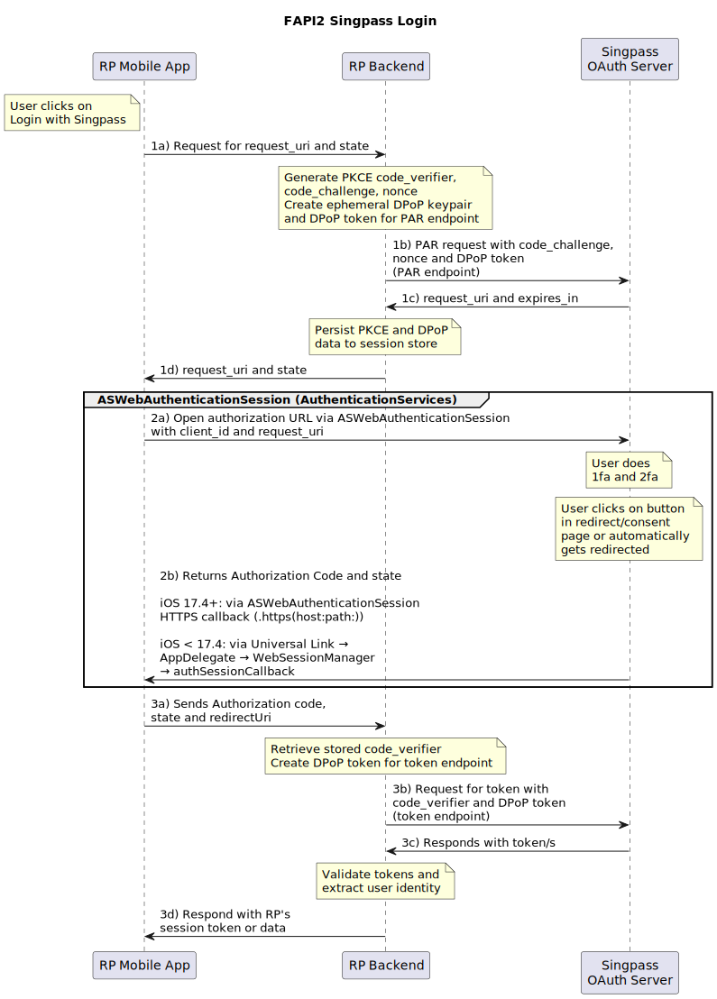
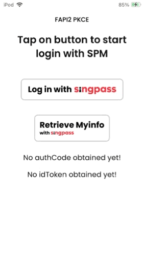
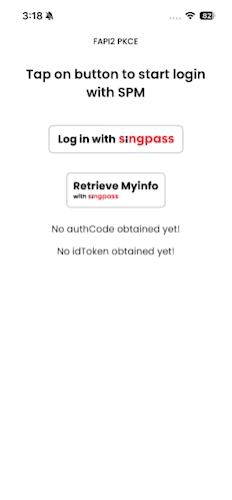
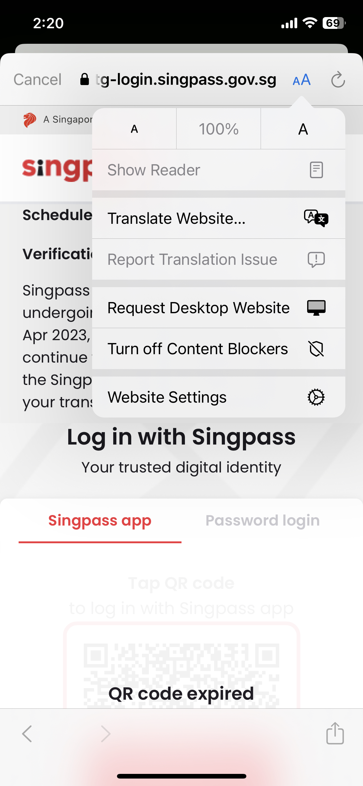
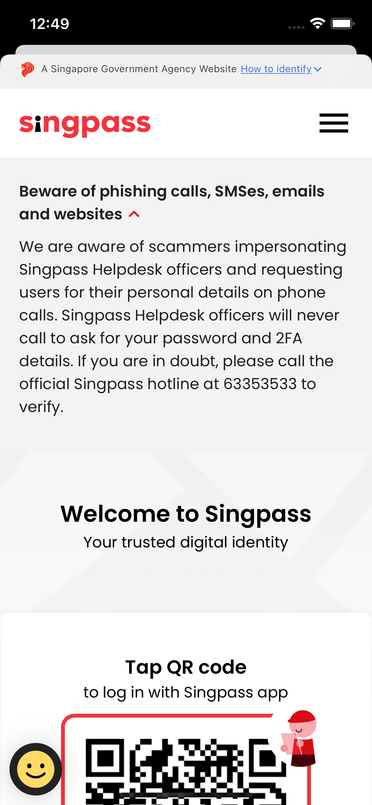
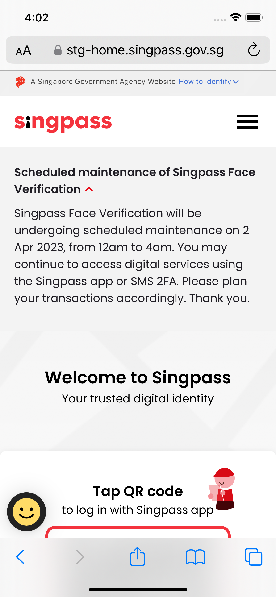
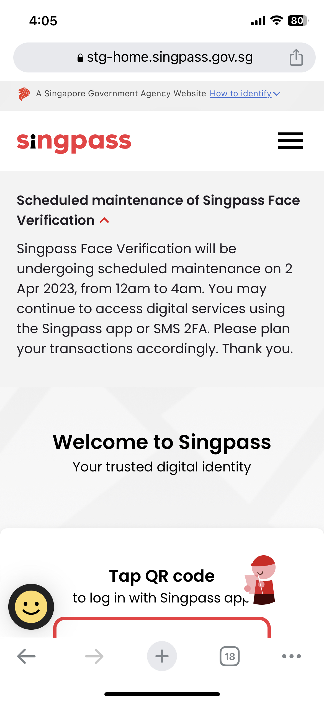

# Migrating away from [WebView](https://developer.apple.com/documentation/webkit/wkwebview) for iOS Mobile app Singpass Logins

Usage of WebViews for web logins are not recommended due to security and usability reasons documented in [RFC8252](https://www.rfc-editor.org/rfc/rfc8252). Google has done the [same](https://developers.googleblog.com/2021/06/upcoming-security-changes-to-googles-oauth-2.0-authorization-endpoint.html) for Google Sign-in in 2021.

> This best current practice requires that only external user-agents
like the browser are used for OAuth by native apps.  It documents how
native apps can implement authorization flows using the browser as
the preferred external user-agent as well as the requirements for
authorization servers to support such usage.

*Quoted from RFC8252.*

This repository contains a sample iOS application demonstrating the FAPI2 Singpass login flow using Apple's [`ASWebAuthenticationSession`](https://developer.apple.com/documentation/authenticationservices/aswebauthenticationsession) — no third-party OAuth library required.

- **FAPI2 Singpass Login** (`Fapi2PkceViewController`) — the recommended modern flow using [Financial-grade API (FAPI2)](https://openid.net/specs/fapi-security-profile-2_0.html) with Pushed Authorization Requests (PAR). The RP Backend handles PKCE and DPoP; the mobile app only passes `request_uri` to the authorization endpoint.

---

# FAPI2 Singpass Login Flow (Fapi2PkceViewController)



<br>

*RP stands for **Relying Party**

- 1a) **RP Mobile App** calls **RP Backend** PAR endpoint to initiate the login session.
<br><br>
- 1b) **RP Backend** generates the PKCE parameters and DPoP keypair, calls the Singpass Pushed Authorization Request (PAR) endpoint, and responds to the **RP Mobile App** with a `request_uri` and `state`.
<br><br>
- 2a) **RP Mobile App** opens the Singpass authorization URL in the browser via [`ASWebAuthenticationSession`](https://developer.apple.com/documentation/authenticationservices/aswebauthenticationsession), supplying `request_uri` as a query parameter. No `code_challenge` is included — all authorization parameters are already encapsulated in the `request_uri`.
<br><br>
- 2b) The `authorization code` and `state` are delivered back to **RP Mobile App** via the redirect URI.
<br><br>
- 3a) **RP Mobile App** relays `code`, `state`, and `redirectUri` to the **RP Backend** receive-auth-code endpoint. #
<br><br>
- 3b) **RP Backend** retrieves the stored PKCE verifier, calls the Singpass token endpoint, validates the tokens, and responds to **RP Mobile App** with a session token or appropriate session data. #
<br><br>

&#8203;# - It is up to the RP to secure the connection between **RP Mobile App** and **RP Backend**

## Potential changes/enhancements for RP Backend (FAPI2)

1. Implement a PAR endpoint that generates PKCE parameters and a DPoP keypair, calls the Singpass PAR endpoint, and returns `request_uri` and `state` to the mobile app.
<br><br>
2. Implement a receive-auth-code endpoint that accepts `code`, `state`, and `redirectUri`, retrieves the stored PKCE verifier, and calls the Singpass token endpoint.
<br><br>
3. Register your `redirect_uri` for your OAuth client_id with Singpass.

## Potential changes/enhancements for RP Mobile App (FAPI2)

1. Use [`ASWebAuthenticationSession`](https://developer.apple.com/documentation/authenticationservices/aswebauthenticationsession) (built into iOS 12+) to handle launching of the authorization endpoint in a secure in-app browser — no third-party library needed.
<br><br>
2. Implement an API call to **RP Backend** to request `request_uri` and `state`.
<br><br>
3. Launch the Singpass authorization URL with `request_uri` as a query parameter using `ASWebAuthenticationSession`.
<br><br>
4. Implement an API call to relay `authorization code`, `state`, and `redirectUri` back to **RP Backend**.

---

# Other Notes
- Please use the parameter `app_launch_url` when opening the authorization endpoint webpage for iOS to enable Singpass App to return to RP mobile app automatically.
  <br><br>
- For FAPI2 flow, a `https` redirect URI is required (e.g. `https://app.singpass.gov.sg/rp/sample`). Add the Associated Domains entitlement with both `applinks:` and `webcredentials:` for the callback domain in your app's `.entitlements` file.
  <br><br>
- The sample mobile application code in this repository receives the token endpoint response from the RP Backend. RPs should **NOT** do this — **RP Backend** should handle the token response and do its appropriate processing.
  <br><br>
- An additional parameter, `redirect_uri_https_type=app_claimed_https` should be added to the `/fapi/par` endpoint when obtaining the `request_uri` to launch in the in-app browser. Adding the parameter will present the user with an interstitial screen with a button if the web browser does not redirect the user back to the mobile app automatically.

---

# Implementation Details

## Required dependencies

None. `ASWebAuthenticationSession` is part of the `AuthenticationServices` framework, available from iOS 12.

## Implementation

### In the entitlements file

Add Associated Domains for the HTTPS redirect URI callback domain:

```xml
<key>com.apple.developer.associated-domains</key>
<array>
    <string>applinks:app.singpass.gov.sg</string>
    <string>webcredentials:app.singpass.gov.sg</string>
</array>
```

`webcredentials` is required by `ASWebAuthenticationSession` when using an HTTPS callback URL on iOS 17.4+. The callback domain must also serve an [Apple App Site Association](https://developer.apple.com/documentation/xcode/supporting-associated-domains) file that includes your app's bundle ID under the `webcredentials` key.

### In the Info.plist

Include camera permission to allow Singpass Face Verification (SFV):
```xml
<key>NSCameraUsageDescription</key>
<string>To enable face verification</string>
```

### In AppConfig.swift

Set your RP Backend Cloud Function endpoints:

```swift
enum AppConfig {
    static let fapiGenerateRequestUriEndpoint = "<your-rp-backend-par-endpoint>"
    static let fapiReceiveAuthCodeEndpoint    = "<your-rp-backend-receive-authcode-endpoint>"
}
```

> `AppConfig.swift` is listed in `.gitignore` to keep backend endpoints out of source control. Copy and fill in the values locally.

### In Fapi2PkceViewController

Set the necessary client IDs and redirect URI:

```swift
let redirectURI:      String = "https://app.singpass.gov.sg/rp/sample"
let callbackHostURL:  String = "app.singpass.gov.sg"
let callbackPath:     String = "/rp/sample"
```

Step 1 — Fetch `request_uri` from RP Backend:
```swift
// GET RP Backend PAR endpoint
var request = URLRequest(url: url)
request.httpMethod = "GET"

URLSession.shared.dataTask(with: request) { data, _, error in
    // parse requestUri, state, nonce from response
    self.performFapiAuthCodeExchange(requestUri: requestUri)
}.resume()
```

Step 2 — Launch authorization URL with `ASWebAuthenticationSession`:
```swift
// iOS 17.4+ — uses the dedicated HTTPS callback API
let session = ASWebAuthenticationSession(
    url: authURL,
    callback: .https(host: callbackHostURL, path: callbackPath)
) { callbackURL, error in
    // parse code and state from callbackURL query items
    self.postFapiAuthCode(authCode: code, state: state)
}

// iOS < 17.4 — callbackURLScheme: nil lets the redirect arrive as a
// Universal Link via AppDelegate → WebSessionManager → authSessionCallback
let session = ASWebAuthenticationSession(
    url: authURL,
    callbackURLScheme: nil
) { _, error in ... }

session.presentationContextProvider = self
session.start()
```

Step 3 — Relay `authorization code` to RP Backend:
```swift
// POST RP Backend receive-auth-code endpoint
// Body (JSON): { code, state, nonce, redirectUri }
var request = URLRequest(url: url)
request.httpMethod = "POST"
request.setValue("application/json", forHTTPHeaderField: "Content-Type")
request.httpBody = try? JSONSerialization.data(withJSONObject: [
    "code":        authCode,
    "state":       state ?? "",
    "nonce":       nonce ?? "",
    "redirectUri": redirectURI
])
```

### In AppDelegate

Handle the Universal Link callback for iOS < 17.4 (app-to-app Singpass flow):

```swift
func application(_ application: UIApplication,
                 continue userActivity: NSUserActivity,
                 restorationHandler: @escaping ([UIUserActivityRestoring]?) -> Void) -> Bool {
    guard userActivity.activityType == NSUserActivityTypeBrowsingWeb,
          let url = userActivity.webpageURL else { return false }

    // parse code and state from url
    // cancel the active ASWebAuthenticationSession and call authSessionCallback
    if let session = WebSessionManager.shared.webAuthSession,
       let vc = WebSessionManager.shared.viewController {
        WebSessionManager.shared.webAuthSession = nil
        session.cancel()
        vc.authSessionCallback(code: code, state: state)
    }
    return false
}
```

## Demo Video/s

**Singpass**

| Below iOS 17.4 | iOS 17.4 and above |
|---|---|
| </img> | </img> |

**MyInfo**

| Below iOS 17.4 | iOS 17.4 and above |
|---|---|
| </img> | </img> |

## FAQ

- How do I know if I am using [Safari](https://developer.apple.com/documentation/safariservices/sfsafariviewcontroller), external web browser or [WebView](https://developer.apple.com/documentation/webkit/wkwebview)?

You can tell if the Singpass login page is being open in [Safari](https://developer.apple.com/documentation/safariservices/sfsafariviewcontroller) by looking at the action sheet. In-app browsers using [Safari](https://developer.apple.com/documentation/safariservices/sfsafariviewcontroller) includes features such as Reader, AutoFill, Fraudulent Website Detection, and content blocking.

Based on Apple's documentation:
<br>
`The view controller includes Safari features such as Reader, AutoFill, Fraudulent Website Detection, and content blocking. In iOS 9 and 10, it shares cookies and other website data with Safari. The user's activity and interaction with SFSafariViewController are not visible to your app, which cannot access AutoFill data, browsing history, or website data. You do not need to secure data between your app and Safari. If you would like to share data between your app and Safari in iOS 11 and later, so it is easier for a user to log in only one time, use ASWebAuthenticationSession instead`

| Safari In-app Browser | Webview |
|---|---|
| </img> |  </img> |

<br>

You can tell if the Singpass login page is opened in a external web browser by looking for the editable address bar. Below are 2 examples.

| Safari Browser | Chrome Browser |
|----------------|----------------|
| </img> | </img> |
