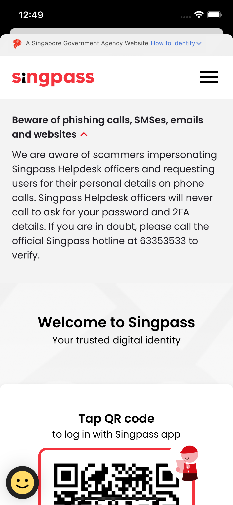

# Migrating away from [WebView](https://developer.apple.com/documentation/webkit/wkwebview) for iOS Mobile app Singpass Logins

Usage of WebViews for web logins are not recommended due to security and usability reasons documented in [RFC8252](https://www.rfc-editor.org/rfc/rfc8252). Google has done the [same](https://developers.googleblog.com/2021/06/upcoming-security-changes-to-googles-oauth-2.0-authorization-endpoint.html) for Google Sign-in in 2021.

> This best current practice requires that only external user-agents
like the browser are used for OAuth by native apps.  It documents how
native apps can implement authorization flows using the browser as
the preferred external user-agent as well as the requirements for
authorization servers to support such usage.

*Quoted from RFC8252.*

This repository has codes for a sample iOS application implementing the recommended [Proof Key for Code Exchange (PKCE)](https://www.rfc-editor.org/rfc/rfc7636) for Singpass logins. The application will demonstrate the Singpass login flow with PKCE leveraging on the iOS [AppAuth](https://github.com/openid/AppAuth-iOS) library.

# Sequence Diagram


<br>

*RP stands for **Relying Party**

- 1a) Call **RP Backend** to obtain backend generate `code_challenge`, `code_challenge_method` along with `state` and `nonce` if required. #
<br><br>
- 1b) **RP Backend** responds with the requested parameters. (`code_challenge`, `code_challenge_method`, `state`, `nonce`) #
  <br><br>
- 2a) Open the Authorization endpoint in web browser via [AppAuth](https://github.com/openid/AppAuth-iOS) providing query params of `redirect_uri`*, `client_id`, `scope`, `code_challenge`, `code_challenge_method` along with `state` and `nonce` if required. There can be other query params provided if needed. e.g. (`purpose_id` for myInfo use cases)
  <br><br>
- 2b) The `authorization code` will be delivered back to **RP Mobile App**.
<br><br>
- 3a) **RP Mobile App** Upon reception of `authorization code`, proceed to relay the Authorization code back to **RP Backend**. #
  <br><br>
- 3b) **RP Backend** will use the `authorization code` along with the generated `code_verifier` along with `state` and `nonce` if required, and do client assertion to call the token endpoint to obtain ID/access tokens.
<br><br>
- 3c) Token endpoint responds with the token payload to **RP Backend**.
  <br><br>
- 3d) **RP Backend** process the token payload and does its required operations and responds to **RP Mobile App** with the appropriate session state tokens or data. #
  <br><br>

&#8203;* - Take note that the `redirect_uri` should be a non-https url that represents the app link of the **RP Mobile App** as configured in the [AppAuth](https://github.com/openid/AppAuth-iOS) library.

&#8203;# - It is up to the RP to secure the connection between **RP Mobile App** and **RP Backend**

# Potential changes/enhancements for RP Backend
1. Implement endpoint to serve `code_challenge`, `code_challenge_method`, `state`, `nonce` and other parameters needed for **RP Mobile App** to initiate the login flow.
   <br><br>
2. Implement endpoint in receive `authorization code`, `state` and other required parameters.
3. Register your new `redirect_uri` for your OAuth client_id

# Potential changes/enhancements for RP Mobile App
1. Integrate [AppAuth](https://github.com/openid/AppAuth-iOS) library to handle launching of authorization endpoint webpage in an in app browser.
   <br><br>
2. Implement api call to **RP Backend** to request for `code_challenge`, `code_challenge_method`, `state` and `nonce` if required and other parameters.
   <br><br>
3. Implement api call to send `authorization code`, `state` and other needed parameters back to **RP Backend**.

# Other Notes
- Please use the query param `app_launch_url` when opening the authorization endpoint webpage for iOS to enable Singpass App to return to RP mobile app automatically.
  <br><br>
- Recommended to **NOT** use `redirect_uri` with a `https` scheme e.g. https://rp.redirectUri/callback due to potential UX issues when redirecting back to **RP Mobile App** from the external web browser. Use iOS URL scheme instead as the redirect_uri. e.g. sg.gov.singpass.app://ndisample.gov.sg/rp/sample*
  <br><br>
- The sample mobile appplication code in this repository receives the token endpoint response from the RP Backend, RPs should **NOT** do this, **RP Backend** should get the token response and do your appropriate processing.

&#8203;*If https scheme for `redirect_uri` is ***really needed*** to be used in your app, please add in a query parameter, `redirect_uri_https_type=app_claimed_https` when launching the authorization endpoint in the in-app browser. (only for direct Singpass logins, not applicable to MyInfo logins).

e.g.
```
https://stg-id.singpass.gov.sg/auth?redirect_uri=https%3A%2F%2Fapp.singpass.gov.sg%2Frp%2Fsample&client_id=ikivDlY5OlOHQVKb8ZIKd4LSpr3nkKsK&response_type=code&state=9_fVucO3cHJIIjR50wr2ctFPYIJLMt_NV6rvLBNQxlztWSCCWbCYMkesXdBC93lX&nonce=7d0c9f09-1c1a-400e-b026-77cc7bc89cd0&scope=openid&code_challenge=ZnRSoTcoIncnebg0mCqNT-E5fbRNQ8zcYkly52-qWxw&code_challenge_method=S256&redirect_uri_https_type=app_claimed_https
```

# Implementation Details

## Required dependencies

AppAuth iOS Library
> pod 'AppAuth'

## Implementation

### In the Info.plist

Configure a custom URL scheme for your app in Info.plist with `redirect_uri`.

```xml
<dict>
  <key>CFBundleURLTypes</key>
  <array>
    <dict>
      <key>CFBundleTypeRole</key>
      <string>Viewer</string>
      <key>CFBundleURLName</key>
      <string>sg.ndi.sample</string>
      <key>CFBundleURLSchemes</key>
      <array>
        <string>sg.gov.singpass.app</string>
      </array>
    </dict>
  </array>
</dict>
```

### In the ViewController

Set the necessary endpoints such as the `redirect_uri` and service configuration endpoints `issuer`, `authorizationEndpoint` and `tokenEndpoint`. 
```swift
let kRedirectURI: String = "sg.gov.singpass.app://ndisample.gov.sg/rp/sample"
let serviceConfigEndpoints: [String: String] = [
    "issuer": "https://test.api.myinfo.gov.sg",
    "authorizationEndpoint": "https://test.api.myinfo.gov.sg/com/v4/authorize",
    "tokenEndpoint": "https://test.api.myinfo.gov.sg/com/v4/token"
]
```
<br>

### 

The below code snippets OAuth authorization flow with [AppAuth](https://github.com/openid/AppAuth-iOS)

<br>

Create the Oauth service configuration
```swift
  // This is the dictionary that describes the current Oauth service
  // This example is using the test environment for MyInfo Singpass login 
  let configuration = OIDServiceConfiguration(authorizationEndpoint: authURL, tokenEndpoint: tokenURL, issuer: issuerURL)
```
<br>

Create the OAuth authorization request
```swift
// code_challenge and code_challenge_method generated from RP Backend
// Set code_challenge for code_verifier as AppAuth library
// Set code_verifier as nil
// as we are not calling token endpoint from the mobile app  

var request: OIDAuthorizationRequest {
    var dict: [String: String] = [appLaunchURL: appLinkURL]

    if myInfo {
        // MyInfo Singpass login does not need nonce and state
        // It needs purpose_id and has different scope values
        dict["purpose_id"] = "demonstration"

        return OIDAuthorizationRequest(configuration: configuration, // from the above section
                                        clientId: clientID, // RP client_id
                                        clientSecret: nil,
                                        scope: "name", // myinfo_scope
                                        redirectURL: redirectURI, // redirect_uri
                                        responseType: OIDResponseTypeCode, // code
                                        state: nil,
                                        nonce: nil,
                                        codeVerifier: nil,
                                        codeChallenge: codeChallenge,
                                        codeChallengeMethod: codeChallengeMethod,
                                        additionalParameters: dict)
    } else {
        return OIDAuthorizationRequest(configuration: configuration, // from the above section
                                        clientId: clientID, // RP client_id
                                        clientSecret: nil,
                                        scope: OIDScopeOpenID, // scope: openid
                                        redirectURL: redirectURI, // redirect_uri
                                        responseType: OIDResponseTypeCode,  // code
                                        state: state, // state generated from RP Backend
                                        nonce: nonce, // nonce generated from RP Backend
                                        codeVerifier: nil,
                                        codeChallenge: codeChallenge,
                                        codeChallengeMethod: codeChallengeMethod,
                                        additionalParameters: dict)
    }
}
```
<br>

Create the OAuth authorization service to perform authorization code exchange.
Upon reception of authorization code, proceed to relay the Authorization code back to the RP backend.
```swift
OIDAuthorizationService.present(request, presenting: self) { (response, error) in
    
    if let response = response {
        let authState = OIDAuthState(authorizationResponse: response)
        self.setAuthState(authState)
        
        printd("Authorization response with code: \(response.authorizationCode ?? "DEFAULT_CODE")")
        
        self.sampleView.setAuthCode(response.authorizationCode)
        
        if self.myInfo {
            self.postAuthCode()
        } else {
            self.postAuthCode(nonce: request.nonce, state: request.state)
        }
    } else {
        printd("Authorization error: \(error?.localizedDescription ?? "DEFAULT_ERROR")")
    }
}
```

## Permissions
Include camera permission in **info.plist** to allow Singpass Face Verification(SFV)
```
<key>NSCameraUsageDescription</key>
<string>To enable face verification</string>
```
<br>


## Demo Video/s

| MyInfo Mockpass Demo | Singpass Demo |
|---|---|
| </img> |  </img> |

## FAQ

- How do I know if I am using [Safari](https://developer.apple.com/documentation/safariservices/sfsafariviewcontroller), external web browser or [WebView](https://developer.apple.com/documentation/webkit/wkwebview)?

You can tell if the Singpass login page is being open in [Safari](https://developer.apple.com/documentation/safariservices/sfsafariviewcontroller) by looking at the action sheet. In-app browsers using [Safari](https://developer.apple.com/documentation/safariservices/sfsafariviewcontroller) includes features such as Reader, AutoFill, Fraudulent Website Detection, and content blocking.

Based on Apple's documentation:
<br>
`The view controller includes Safari features such as Reader, AutoFill, Fraudulent Website Detection, and content blocking. In iOS 9 and 10, it shares cookies and other website data with Safari. The user's activity and interaction with SFSafariViewController are not visible to your app, which cannot access AutoFill data, browsing history, or website data. You do not need to secure data between your app and Safari. If you would like to share data between your app and Safari in iOS 11 and later, so it is easier for a user to log in only one time, use ASWebAuthenticationSession instead`

| Safari In-app Browser | Webview |
|---|---|
| </img> |  </img> |

<br>

You can tell if the Singpass login page is opened in a external web browser by looking for the editable address bar. Below are 2 examples.

| Safari Browser | Chrome Browser |     
|----------------|----------------|
| </img> | </img> |